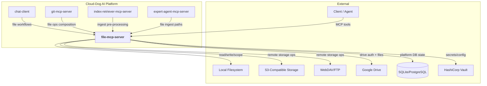
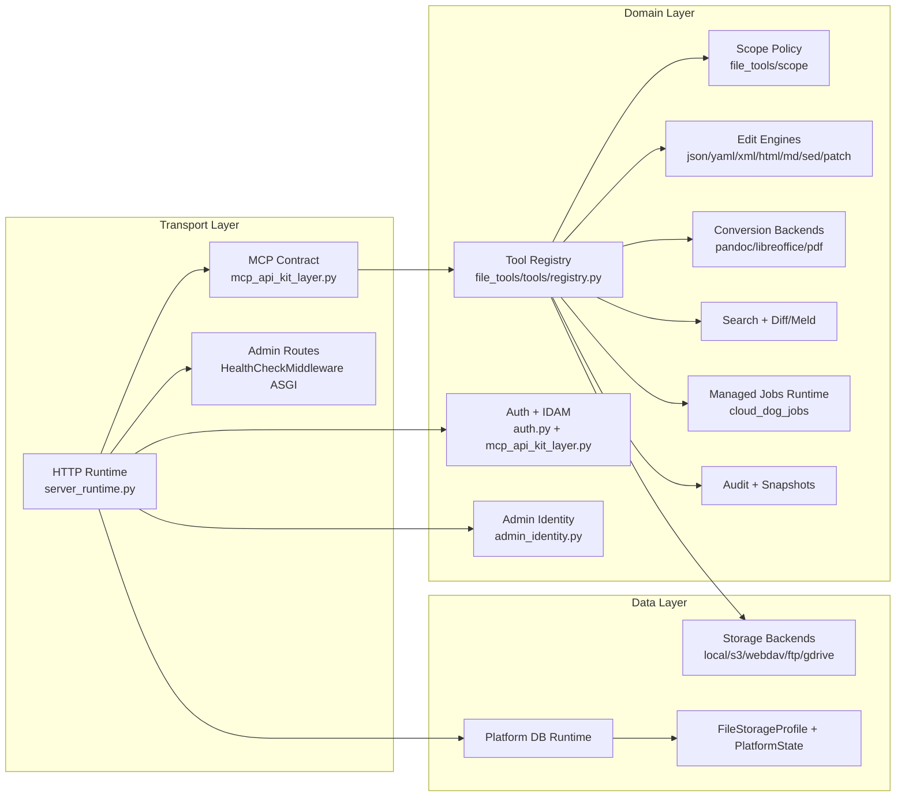
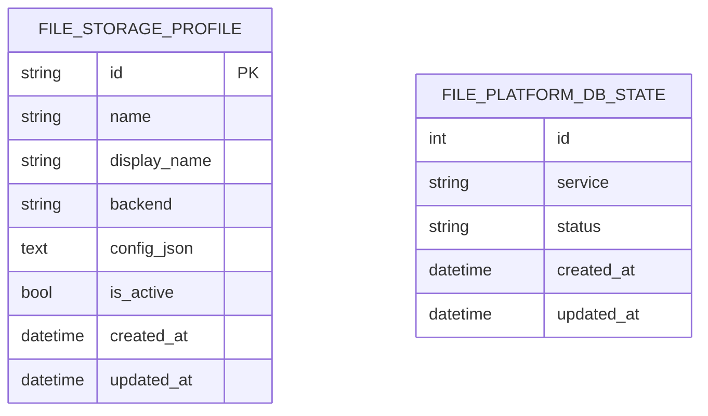
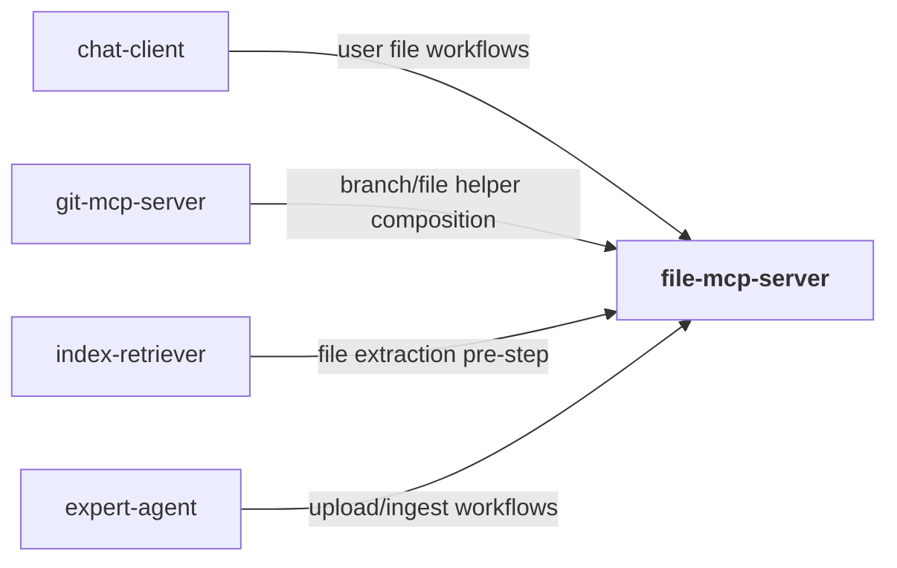
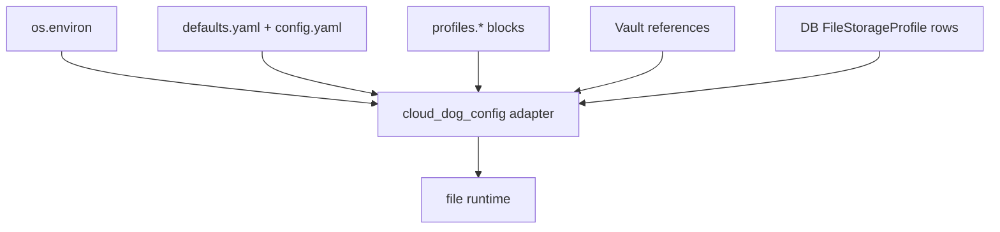
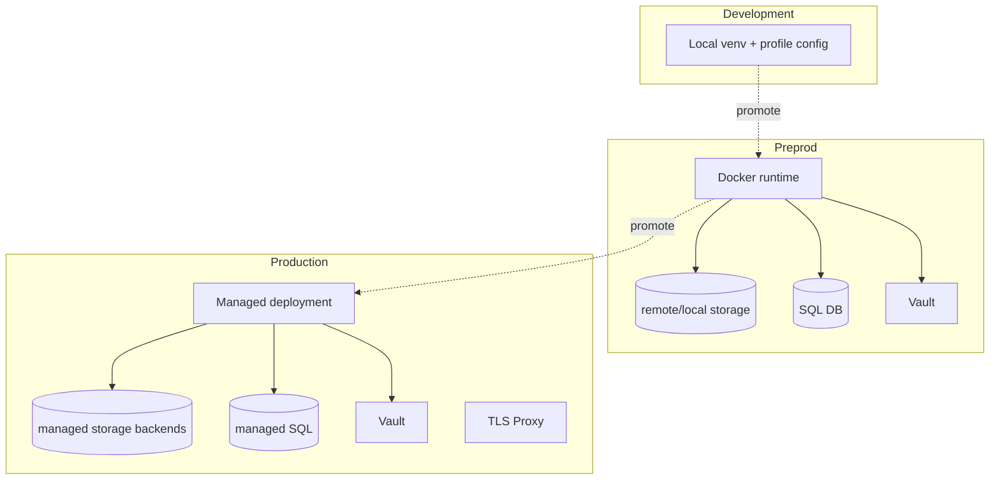
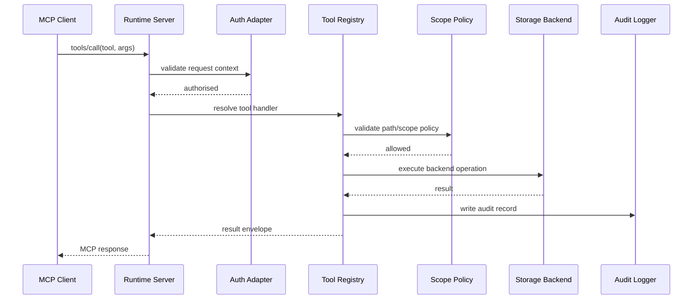
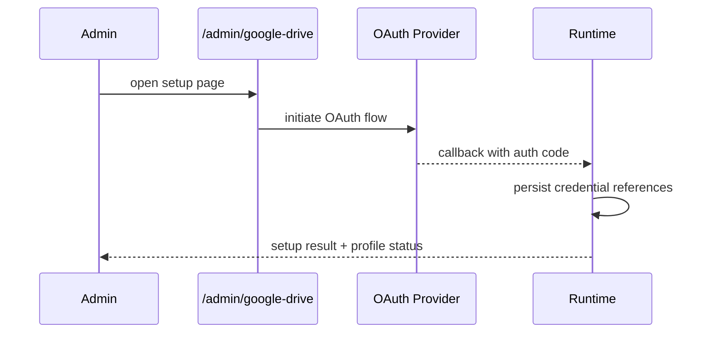

# File MCP Server — Architecture

## W28A-421 Review Status
- Reviewed for external/shareable publication during W28A-421.
- Source basis: `defaults.yaml`, 69 Python source files across 17 packages/sub-packages, 65 MCP tools, and 20+ HTTP endpoints.
- Internal-only absolute paths, environment-specific hosts, and private registries have been removed from this shareable document set.

## 1. Overview
`file-mcp-server` provides file and document operations over MCP/HTTP transports with strong path scope controls, audit trails, and multi-backend storage support.

The system exposes a large tool surface for read/write, structured editing (JSON/YAML/XML/HTML/Markdown), conversions, diff/meld, validation, and remote storage interactions. Runtime behaviour is profile-driven, allowing isolated policy sets per workspace or tenant.

This service is a foundational utility backend for platform workflows that require deterministic and policy-safe file operations.

## 2. System Context Diagram


`file-mcp-server` is primarily a secure file-operation engine with pluggable storage targets and protocol-compatible MCP interfaces.

## 3. Component Architecture


The runtime separates protocol handling from tool implementations, allowing policy checks and auditing to wrap every tool execution uniformly.

## 4. Source Tree
```
src/
  file_mcp_server/              # Server runtime package (15 modules)
    __init__.py
    __main__.py                 # python -m entrypoint
    main.py                     # CLI process control and env wiring
    server.py                   # Compatibility re-exports from server_runtime
    server_runtime.py           # HTTP/MCP runtime, tool registration, ASGI middleware stack
    mcp_api_kit_layer.py        # FastAPI MCP transport (cloud_dog_api_kit integration)
    mcp_tool_audit_shim.py      # Fallback audit middleware when api_kit audit unavailable
    auth.py                     # Multi-profile API key + token verifier
    admin_identity.py           # Admin user/group/API-key CRUD service
    google_drive_admin.py       # Google Drive OAuth setup UI and callback
    endpoint_health.py          # Storage backend health monitoring
    jobs_runtime.py             # Managed job queue lifecycle (sql/redis backends)
    lifecycle.py                # Server lifecycle hooks
    requirement_traceability.py # Requirement-to-code traceability metadata
    db/
      __init__.py
      models.py                 # SQLAlchemy models (FileStorageProfile, PlatformDbState)
      runtime.py                # DB startup, session management, health checks

  file_tools/                   # Domain library package (37 modules)
    __init__.py
    limits.py                   # Timeout and size limit enforcement
    logging_adapter.py          # Structured logging adapter
    observability.py            # Observability helpers
    posix.py                    # POSIX permission utilities
    adapters/
      __init__.py
      http_client.py            # HTTP client adapter for remote backends
      yaml_codec.py             # Safe YAML dump/load codec
    audit/
      __init__.py
      adapter.py                # Audit log adapter
      logger.py                 # JSONL audit event writer
      snapshots.py              # Pre-mutation snapshot creation and pruning
    config/
      __init__.py
      adapter.py                # Config loading adapter (env + yaml + vault)
      loader.py                 # Config file discovery and merge
      models.py                 # Pydantic config models (ProfileConfig, ServerConfig, etc.)
    convert/
      __init__.py
      converters.py             # Conversion pipeline orchestration
      backends/
        __init__.py
        libreoffice.py          # LibreOffice backend
        pandoc.py               # Pandoc backend
        pdf.py                  # PDF extraction backend
    diff/
      __init__.py
      diffgen.py                # Unified diff generation
      meld.py                   # Meld GUI launcher integration
    edit/
      __init__.py
      jsonyaml.py               # JSON and YAML path-based get/set/delete/copy/move/merge
      markdown.py               # Markdown section extraction and frontmatter editing
      patch.py                  # Line-range replacement and insert operations
      sedlike.py                # Sed-like regex-based file editing
      xmlhtml.py                # XML/HTML path-based set operations
    io/
      __init__.py
      encoding.py               # Base64 encode/decode utilities
      filesystem.py             # Core filesystem read/write/list/delete/copy/move
    scope/
      __init__.py
      policy.py                 # Path scope enforcement (allow/deny globs, ext filters)
    search/
      __init__.py
      find.py                   # Content and path search with limits and timeouts
    storage/
      __init__.py
      base.py                   # Abstract storage backend interface
      factory.py                # Storage backend factory (selects by profile config)
      local.py                  # Local filesystem backend
      s3.py                     # S3-compatible storage backend
      webdav.py                 # WebDAV storage backend
      ftp.py                    # FTP/FTPS storage backend
      google_drive.py           # Google Drive storage backend
    tools/
      __init__.py
      definitions.py            # ToolMeta, ToolSchema, ToolDefinition models
      registry.py               # ToolRegistry (register/list/get)
    validate/
      __init__.py
      policy.py                 # Validation mode enforcement (warn/reject/skip)
      validators.py             # Type-specific content validators
```

## 5. Module Decomposition
| Module | Path | Responsibility | Platform Package |
|---|---|---|---|
| Runtime server | `src/file_mcp_server/server_runtime.py` | HTTP/MCP contract, health/readiness/status middleware, tool registration, admin routes, A2A skill dispatch, WebUI SPA serving | `cloud_dog_api_kit` |
| MCP transport layer | `src/file_mcp_server/mcp_api_kit_layer.py` | FastAPI MCP JSON-RPC app, tool contract generation, RBAC enforcement | `cloud_dog_api_kit` |
| MCP audit shim | `src/file_mcp_server/mcp_tool_audit_shim.py` | Fallback audit middleware | — |
| Auth | `src/file_mcp_server/auth.py` | Multi-profile API key verifier with dynamic key resolution | `cloud_dog_idam` |
| Admin identity | `src/file_mcp_server/admin_identity.py` | User/group/API-key CRUD service (DB-backed) | `cloud_dog_idam` |
| Google Drive admin | `src/file_mcp_server/google_drive_admin.py` | OAuth setup UI rendering and callback handling | — |
| Endpoint health | `src/file_mcp_server/endpoint_health.py` | Storage backend health probing and recovery | — |
| Jobs runtime | `src/file_mcp_server/jobs_runtime.py` | Managed job queue lifecycle for long-running file operations | `cloud_dog_jobs` |
| Lifecycle | `src/file_mcp_server/lifecycle.py` | Server lifecycle hooks | — |
| Entrypoint | `src/file_mcp_server/main.py` | CLI process control and env wiring | — |
| Server compat | `src/file_mcp_server/server.py` | Thin re-export layer for backward compatibility | — |
| DB runtime/models | `src/file_mcp_server/db/runtime.py`, `db/models.py` | DB startup, session management, FileStorageProfile model | `cloud_dog_db` |
| Tool registry | `src/file_tools/tools/registry.py`, `tools/definitions.py` | Tool definition models and dispatch registry | — |
| Config models | `src/file_tools/config/models.py`, `config/adapter.py`, `config/loader.py` | Typed profile configuration and config loading | `cloud_dog_config` |
| Audit subsystem | `src/file_tools/audit/*` | JSONL audit events, adapter, and snapshot management | `cloud_dog_logging` |
| Storage backends | `src/file_tools/storage/*` | local/s3/webdav/ftp/gdrive backends with abstract base | — |
| Scope policy | `src/file_tools/scope/policy.py` | Path allow/deny glob enforcement, ext filtering | — |
| Edit engines | `src/file_tools/edit/*` | JSON/YAML, XML/HTML, Markdown, sed-like, patch editing | — |
| Conversion | `src/file_tools/convert/*` | Conversion pipeline with pandoc, libreoffice, pdf backends | — |
| Diff/meld | `src/file_tools/diff/*` | Unified diff generation and meld integration | — |
| Search | `src/file_tools/search/find.py` | Content and path search with limits | — |
| I/O | `src/file_tools/io/*` | Filesystem operations and base64 encoding | — |
| Validation | `src/file_tools/validate/*` | Content validation with policy modes | — |
| Adapters | `src/file_tools/adapters/*` | HTTP client, YAML codec | — |
| Limits | `src/file_tools/limits.py` | Timeout and size enforcement | — |
| Observability | `src/file_tools/observability.py`, `logging_adapter.py` | Structured logging and observability | `cloud_dog_logging` |
| POSIX | `src/file_tools/posix.py` | POSIX permission utilities | — |

## 6. Data Model


`file-mcp-server` uses `cloud_dog_db` for runtime DB integration. `FileStorageProfile` stores dynamic profile configurations seeded from `defaults.yaml` on first startup. `FilePlatformDbState` persists service-level platform state. Operational artefacts (audit JSONL, snapshots, file outputs) are stored in filesystem/storage backends.

## 7. Interface Specifications
### 7.1 MCP Transport
The primary interface is MCP JSON-RPC over streamable-HTTP at `/mcp`. The transport supports:
- `tools/list` — enumerate registered tools
- `tools/call` — invoke a tool by name with arguments
- Standard MCP lifecycle methods

Transport modes: `streamable_http`, `http_jsonrpc`, `legacy_sse` (configured via `mcp_server.transport`).

### 7.2 HTTP Endpoints
| Method | Path | Description | Auth |
|---|---|---|---|
| GET | `/health` | Liveness and profile health summary | None |
| GET | `/ready` | Readiness with dependency checks | None |
| GET | `/live` | Simple liveness probe | None |
| GET | `/status` | Extended status payload | None |
| POST | `/mcp` | MCP JSON-RPC endpoint (streamable-HTTP) | API key/JWT |
| GET | `/mcp/tools` | MCP tool catalogue helper | Optional |
| GET | `/.well-known/agent.json` | A2A agent card | None |
| POST | `/a2a/tasks` | A2A task submission | API key |
| GET | `/a2a/health` | A2A health check | None |
| GET | `/api/v1/jobs` | Managed jobs list with filters | API key |
| GET | `/api/v1/jobs/queue/status` | Queue backend counters | API key |
| GET | `/api/v1/jobs/{job_id}` | Job status lookup | API key |
| POST | `/admin/reload` | Reload profile/tool registry | Admin auth |
| GET | `/admin/google-drive` | Google Drive setup UI | Admin auth |
| GET | `/admin/google-drive/callback` | OAuth callback | Admin auth |
| REST | `/admin/users`, `/admin/groups`, `/admin/api-keys` | Identity management CRUD | Admin auth |
| REST | `/admin/profiles` | Dynamic profile CRUD | Admin auth |
| POST | `/auth/login` | WebUI cookie-based login | Credentials |
| GET | `/auth/me` | Session info | Cookie/API key |
| POST | `/auth/logout` | Destroy web session | Cookie |

### 7.3 MCP Tools
| Tool | Description | Category |
|---|---|---|
| `read_file`, `write_file`, `delete_file`, `move_file`, `copy_file`, `move_path`, `rename_path`, `create_dir`, `chmod_path`, `list_dir` | Core file CRUD and directory ops | io |
| `search_content`, `search_paths` | Content/path search | search |
| `b64_encode`, `b64_decode`, `b64_encode_file`, `b64_decode_to_file` | Base64 encoding/decoding | encoding |
| `json_get`, `json_set`, `json_delete`, `json_copy`, `json_move`, `json_merge` | In-memory JSON editing | edit |
| `yaml_get`, `yaml_set`, `yaml_delete`, `yaml_copy`, `yaml_move`, `yaml_merge` | In-memory YAML editing | edit |
| `json_get_file`, `json_set_file`, `json_copy_file`, `json_move_file`, `json_merge_file` | File-backed JSON editing | edit |
| `yaml_get_file`, `yaml_set_file`, `yaml_delete_file`, `yaml_copy_file`, `yaml_move_file`, `yaml_merge_file` | File-backed YAML editing | edit |
| `xml_set_file`, `html_set_file` | File-backed XML/HTML editing | edit |
| `markdown_get_section`, `markdown_set_section`, `markdown_set_section_file`, `markdown_set_frontmatter_file` | Markdown section and frontmatter editing | edit |
| `replace_regex`, `sed_edit_file` | Regex and sed-like editing | edit |
| `validate_text`, `validate_file` | Content validation | validation |
| `convert_file` | Document conversion (managed jobs by profile) | conversion |
| `diff_text`, `diff_files`, `meld_files` | Comparison workflows | diff |
| `backend_status` | Backend status probe | admin |
| `admin_list_users`, `admin_create_user`, `admin_update_user`, `admin_delete_user` | Admin user management | admin |
| `admin_list_groups`, `admin_create_group`, `admin_update_group`, `admin_delete_group` | Admin group management | admin |
| `admin_list_api_keys`, `admin_create_api_key`, `admin_revoke_api_key` | Admin API key management | admin |

### 7.4 A2A Skills
| Skill ID | Description |
|---|---|
| `file-management` | Dispatch any MCP tool via JSON payload |
| `file-search` | Search files by name or content |
| `gdrive-sync` | Google Drive upload/download tools |

## 8. Dependencies & External Services
### 8.1 Platform Packages
| Package | Version | Usage in this project |
|---|---|---|
| `cloud_dog_api_kit` | `>=0.2.0` | HTTP integration patterns, MCP contract registration, A2A skill model |
| `cloud_dog_config` | `>=0.2.0` | Profile/config loading |
| `cloud_dog_db` | `>=0.1.0` | DB runtime and `PlatformBase` models |
| `cloud_dog_idam` | `>=0.2.0` | Auth middleware, token verification, RBAC engine, audit emitter |
| `cloud_dog_logging` | `>=0.2.0` | Structured audit/log adapters |
| `cloud_dog_jobs` | `>=0.2.0` | Managed job queue backends and lifecycle APIs |
| `cloud_dog_storage` | `>=0.1.0` | Path utilities |

### 8.2 External Services
| Service | Purpose | Connection | Vault Path |
|---|---|---|---|
| Local filesystem | Primary storage backend | profile storage config | n/a |
| S3/WebDAV/FTP | Remote storage backends | profile storage config | `dev.storage.*` |
| Google Drive | Remote storage backend with OAuth | admin setup + profile config | `dev.storage.gdrive.*` |
| SQL database | Platform state persistence | `db.url`/runtime config | `dev.databases.*` |
| Vault | Secret/config resolution | env + vault client | `secret/*` |

### 8.3 Cross-Project Dependencies


## 9. Configuration Architecture


Profile domains include auth, scope, audit, limits, conversion, jobs, storage, TLS, snapshots, validation, observability, and endpoint-health behaviours. Dynamic profiles can be created at runtime via the admin API and are persisted in the database.

## 10. Security Architecture
- Authentication: profile-configurable IDAM/token validation at runtime; multi-profile API key routing.
- Authorisation: scope policies, per-tool RBAC via `cloud_dog_idam.RBACEngine`, and role-sensitive admin endpoints.
- Secrets: backend credentials from env/Vault-backed profile settings.
- Audit: per-operation audit records with MCP tool audit middleware and optional snapshot retention.
- Network: health/readiness/admin and MCP endpoints with configurable TLS/proxy behaviour.

## 11. Deployment Architecture


## 12. Key Flows
### 12.1 MCP Tool Execution Flow


### 12.2 Google Drive Admin Setup Flow


## 13. Non-Functional Characteristics
| Characteristic | Approach |
|---|---|
| Scalability | Stateless tool dispatch over pluggable storage backends; multi-profile isolation |
| Reliability | Endpoint health manager with configurable retry/recovery, readiness checks, deterministic tool envelopes |
| Observability | Structured audit JSONL + MCP tool audit middleware + operation metadata |
| Performance | Direct backend execution with bounded limits/timeouts; managed job queue for long-running operations |
| Maintainability | Clear split between runtime (15 modules), tool library (37 modules), storage, and config models |
