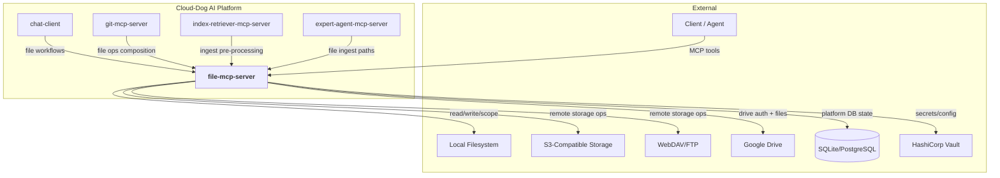
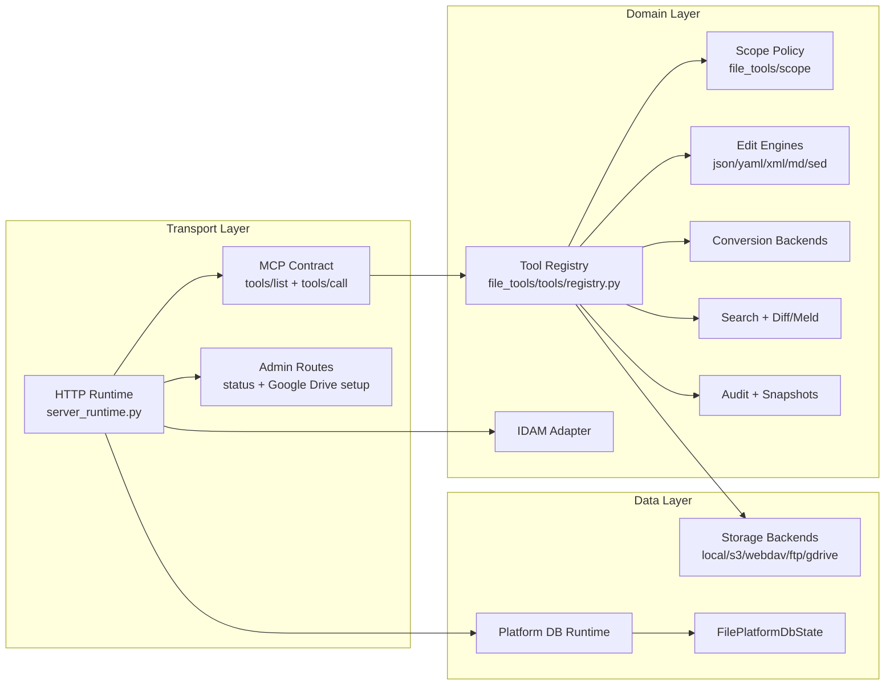
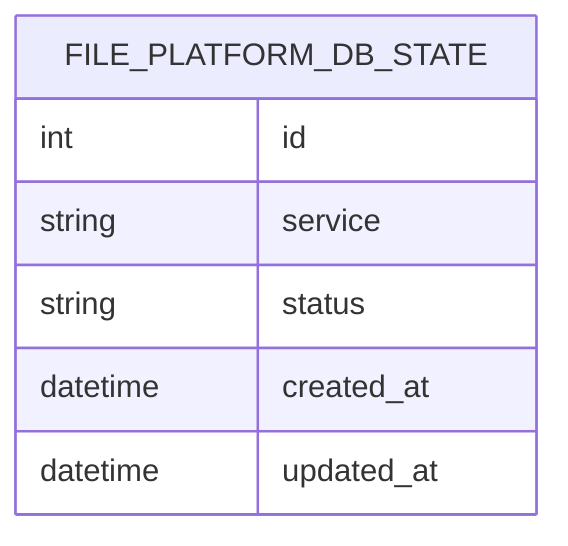
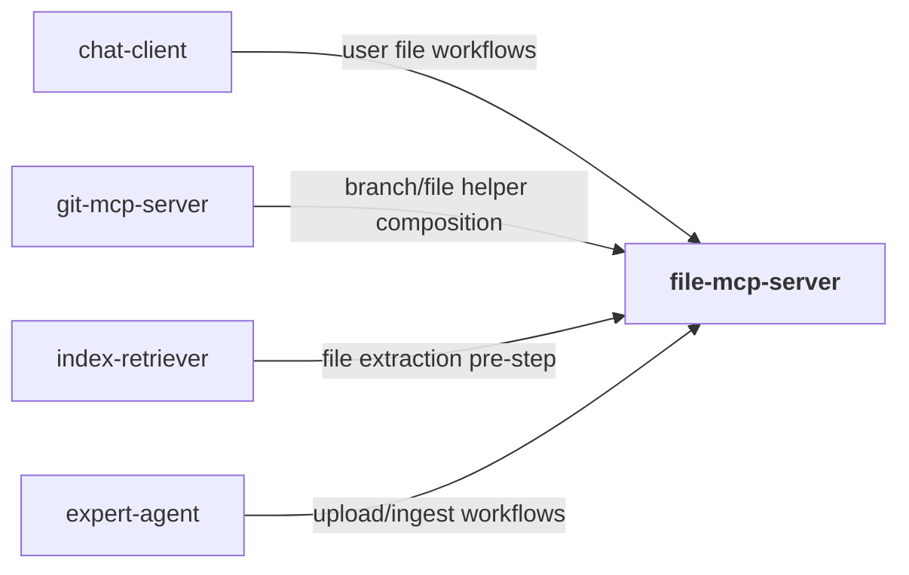
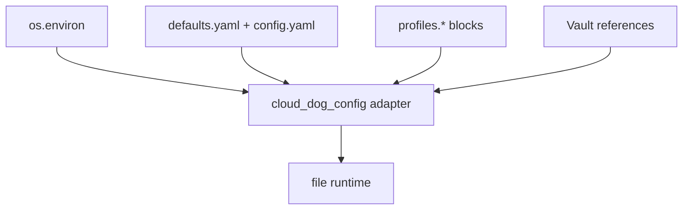
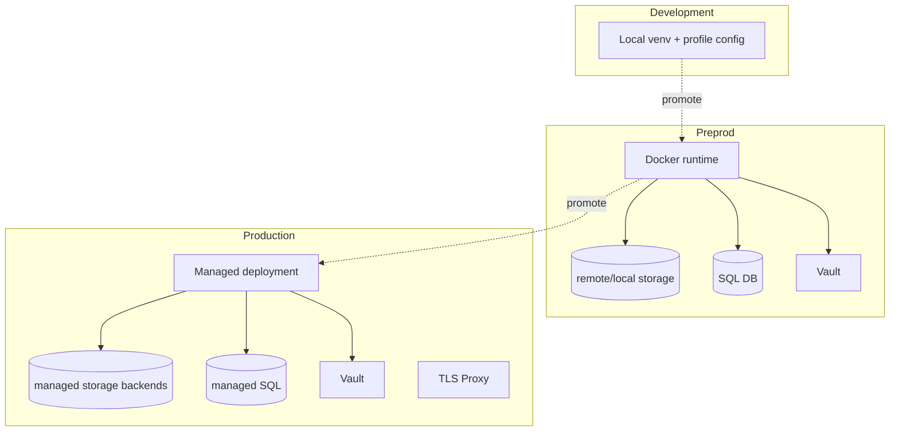
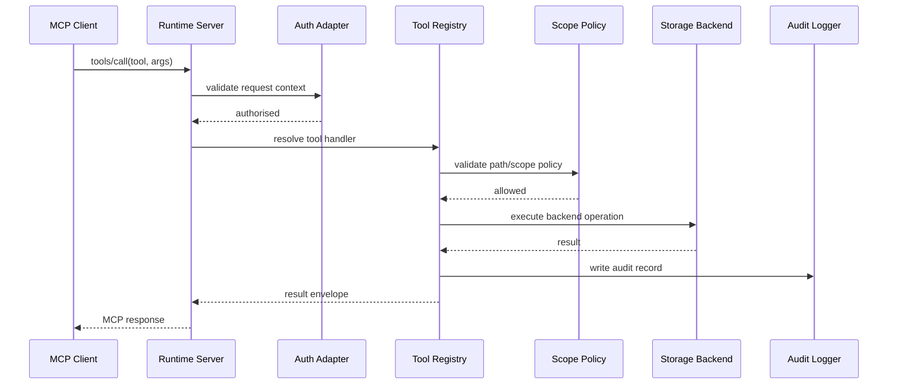
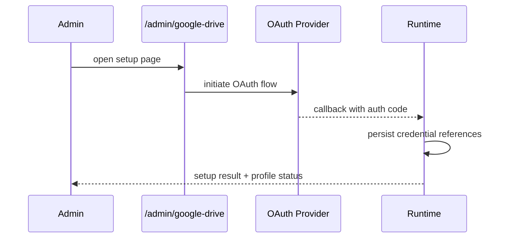

# File MCP Server — Architecture

## 1. Overview
`file-mcp-server` provides file and document operations over MCP/HTTP transports with strong path scope controls, audit trails, and multi-backend storage support.

The system exposes a large tool surface for read/write, structured editing (JSON/YAML/XML/Markdown), conversions, diff/meld, validation, and remote storage interactions. Runtime behaviour is profile-driven, allowing isolated policy sets per workspace or tenant.

This service is a foundational utility backend for platform workflows that require deterministic and policy-safe file operations.

## 2. System Context Diagram

`file-mcp-server` is primarily a secure file-operation engine with pluggable storage targets and protocol-compatible MCP interfaces.

## 3. Component Architecture

The runtime separates protocol handling from tool implementations, allowing policy checks and auditing to wrap every tool execution uniformly.

## 4. Module Decomposition
| Module | Path | Responsibility | Platform Package |
|---|---|---|---|
| Runtime server | `src/file_mcp_server/server_runtime.py` | HTTP/MCP contract, readiness, admin routes, tool registration | `cloud_dog_api_kit` compatible patterns |
| Entrypoint | `src/file_mcp_server/main.py` | CLI process control and env wiring | — |
| Auth adapter | `src/file_mcp_server/idam_adapter.py` | Token verification and request context | `cloud_dog_idam` |
| DB runtime/models | `src/file_mcp_server/db/runtime.py`, `src/file_mcp_server/db/models.py` | DB startup and platform state table | `cloud_dog_db` |
| Tool registry | `src/file_tools/tools/registry.py` | Tool definitions and dispatch contract | — |
| Config models | `src/file_tools/config/models.py` | Typed profile configuration | `cloud_dog_config` |
| Audit subsystem | `src/file_tools/audit/*` | JSONL audit events and snapshots | `cloud_dog_logging` |
| Storage backends | `src/file_tools/storage/*` | local/s3/webdav/ftp/gdrive backends | — |
| File engines | `src/file_tools/io/*`, `src/file_tools/edit/*`, `src/file_tools/convert/*` | Core file operation implementations | — |

## 5. Data Model

`file-mcp-server` uses `cloud_dog_db` for runtime DB integration and currently persists service-level platform state in `file_platform_db_state`. Operational artefacts (audit JSONL, snapshots, file outputs) are stored in filesystem/storage backends.

## 6. Interface Specifications
### 6.1 REST API
| Method | Path | Description | Auth |
|---|---|---|---|
| GET | `/health` | Liveness and profile health summary | None |
| GET | `/ready` | Readiness with dependency checks | None |
| GET | `/` | Status page/summary payload | Optional |
| GET | `/mcp/tools` | MCP tool catalogue helper | Optional/API key |
| POST | `/mcp` | MCP JSON-RPC endpoint (streamable/http mode) | API key/JWT (profile dependent) |
| GET | `/admin/google-drive` | Google Drive setup UI | Admin auth |
| GET | `/admin/google-drive/callback` | OAuth callback | Admin auth |
| POST | `/admin/reload` | Reload profile/tool registry | Admin auth |

### 6.2 MCP Tools
| Tool | Description | Category |
|---|---|---|
| `read_file`, `write_file`, `delete_file`, `move_file`, `copy_file` | Core file CRUD | io |
| `list_dir`, `create_dir`, `move_path`, `rename_path` | Directory/path operations | io |
| `search_content`, `search_paths` | Content/path search | search |
| `json_*`, `yaml_*`, `xml_set_file`, `markdown_*`, `sed_edit_file` | Structured editing operations | edit |
| `convert_file` | Document conversion pipeline | conversion |
| `diff_files`, `diff_text`, `meld_files` | Comparison workflows | diff |
| `validate_file`, `validate_text` | Validation and policy checks | validation |
| `backend_status` | Backend status probe | admin |

### 6.3 A2A Endpoints
Dedicated A2A server is not a primary surface in this project; the canonical machine interface is MCP/HTTP.

## 7. Dependencies & External Services
### 7.1 Platform Packages
| Package | Version | Usage in this project |
|---|---|---|
| `cloud_dog_api_kit` | `>=0.2.0` | HTTP integration patterns and server conventions |
| `cloud_dog_config` | `>=0.2.0` | Profile/config loading |
| `cloud_dog_db` | `>=0.1.0` | DB runtime and `PlatformBase` models |
| `cloud_dog_idam` | `>=0.2.0` | Auth middleware and token verification |
| `cloud_dog_logging` | `>=0.2.0` | Structured audit/log adapters |

### 7.2 External Services
| Service | Purpose | Connection | Vault Path |
|---|---|---|---|
| Local filesystem | Primary storage backend | profile storage config | n/a |
| S3/WebDAV/FTP | Remote storage backends | profile storage config | `dev.storage.*` |
| Google Drive | Remote storage backend with OAuth | admin setup + profile config | `dev.storage.gdrive.*` |
| SQL database | Platform state persistence | `db.url`/runtime config | `dev.databases.*` |
| Vault | Secret/config resolution | env + vault client | `secret/*` |

### 7.3 Cross-Project Dependencies

## 8. Configuration Architecture

Profile domains include auth, scope, audit, limits, conversion, storage, TLS, and endpoint-health behaviours.

## 9. Security Architecture
- Authentication: profile-configurable IDAM/token validation at runtime.
- Authorisation: scope policies and role-sensitive admin endpoints.
- Secrets: backend credentials from env/Vault-backed profile settings.
- Audit: per-operation audit records and optional snapshot retention.
- Network: health/readiness/admin and MCP endpoints with configurable TLS/proxy behaviour.

## 10. Deployment Architecture

## 11. Key Flows
### 11.1 MCP Tool Execution Flow

### 11.2 Google Drive Admin Setup Flow

## 12. Non-Functional Characteristics
| Characteristic | Approach |
|---|---|
| Scalability | Stateless tool dispatch over pluggable storage backends |
| Reliability | Endpoint health manager, readiness checks, deterministic tool envelopes |
| Observability | Structured audit JSONL + operation metadata |
| Performance | Direct backend execution with bounded limits/timeouts |
| Maintainability | Clear split between runtime, tool library, storage, and config models |
